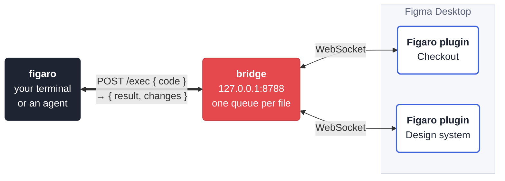

<p align="center">
  
</p>

<h1 align="center">Figaro</h1>

<p align="center">
  <b><i>Figaro here, Figaro there.</i></b><br>
  Your coding agent, at work in Figma: it reads real files, builds with your design system and checks its own work.
</p>

<p align="center">
  <a href="#quick-start">Quick start</a> ·
  <a href="#how-it-works">How it works</a> ·
  <a href="#working-with-claude-code">Claude Code</a> ·
  <a href="#commands">Commands</a> ·
  <a href="#safety-net">Safety net</a> ·
  <a href="#troubleshooting">Troubleshooting</a>
</p>

<p align="center">
  
  
  
  
</p>

---

Figaro connects an AI agent (or you, in a terminal) to the files you have open in **Figma Desktop**. The
`figaro` command sends JavaScript to a small server on your machine, the server hands it to the Figaro plugin
running in your file, and the answer comes back in milliseconds. Everything stays local: no Figma API token,
no cloud service, nothing to publish.

```console
$ figaro inspect "https://www.figma.com/design/AbCdEf/Checkout?node-id=12-34"
"Card" FRAME 12:34 in "Checkout" · 3 layers
https://www.figma.com/design/AbCdEf/Checkout?node-id=12-34

Card [FRAME] 12:34 320×200 · ↓ gap 12 pad 24 16 · fixed×hug · r 12 · fill 'Surface/Card' #ffffff (surface/card)
  Title [TEXT] 12:35 288×24 · fill×hug · "Order summary" · Inter Semi Bold 20/24 · style 'Heading/H3'
  Button [INSTANCE] 12:36 120×40 · ⟐ Button / Size=M · Label="Pay now", Size="M"
…

$ figaro text 12:35 "Your order"
  changed: ~1 (characters)
  checkpoint: "Figaro · before changes by an agent" — File → Version history
{
  "id": "12:35",
  "before": "Order summary",
  "after": "Your order"
}
  (38ms)

$ figaro shot 12:34
/tmp/figaro/shots/AbCdEf/12-34.png  640×400 · "Card" 2×
```

## Why Figaro

- **The whole Plugin API, from a shell.** A script runs inside Figma with `figma`, plus thirty `h.*` helpers
  for auto-layout, text and fonts, variables, components and variants.
- **Links instead of ids.** Paste a link to a file or a layer (*Copy link to selection*) wherever a command
  takes a target.
- **An agent that can see.** `inspect` prints a layer with its auto-layout, styles, variables and component
  keys; `shot` saves a picture the agent can open and check.
- **A safety net.** A checkpoint in the file's version history before the first change, a report of what
  every script changed, read-only runs that roll back, and an `undo` that refuses when it isn't safe.
- **Many agents, many files.** Each file has its own queue, so parallel agents never interleave their edits.
- **Comes with a Claude Code skill.** It teaches agents the loop *look → change → look* and the rules of clean
  Figma work: real components, tokens instead of hex, even grids, a stop for your review.
- **Nothing to babysit.** The CLI starts the server when it is needed, and the server leaves by itself after
  three idle hours.

## How it works



- **`figaro`** (`figaro.py`) is the CLI. Every command, from `inspect` to `exec`, becomes a short script.
- **The bridge** (`bridge.py`) is a small aiohttp server on `127.0.0.1:8788`. It routes each request to the
  right file, keeps one queue per file, saves checkpoints and adds hints to known errors.
- **The plugin** (`plugin/`) is a Figma development plugin. It runs each script as an async function with
  `figma`, `print` and `h`, watches what the script changed, and answers.

## Quick start

You need a **Mac** (Windows works too, with less testing: see [Windows](#windows)),
**[Figma Desktop](https://www.figma.com/downloads/)** (the browser version can't run local development
plugins), **Git** and **Python 3.9+**. On a Mac both come with Apple's Command Line Tools: if
`git --version` answers, you have them, and `xcode-select --install` installs them if not.
[Claude Code](https://claude.com/claude-code) is optional, for the agent skill.

**1. Install the command and the skill**

```sh
git clone https://github.com/artem-levchenko-2/figaro.git ~/figaro
cd ~/figaro
bash tools/install.sh
```

The script makes `venv/` with the two dependencies (`aiohttp`, `Pillow`), writes the `figaro` command to
`~/.local/bin` and links the skill into `~/.claude/skills`. It is safe to run again, and it never overwrites
a file it didn't make. If it says `~/.local/bin` is not on your PATH:

```sh
echo 'export PATH="$HOME/.local/bin:$PATH"' >> ~/.zshrc && exec zsh
```

**2. Add the plugin to Figma** (once)

In Figma Desktop: **Plugins → Development → Import plugin from manifest…** and pick
`~/figaro/plugin/manifest.json`.

**3. Run it in a file**

Open any file and run **Plugins → Development → Figaro**. A slim bar shows up; it connects as soon as the
bridge runs, and any `figaro` command starts the bridge. Keep the bar open while you or your agents work.
⌘⌥P runs the last plugin again.

**4. Check the chain**

```sh
figaro doctor     # bridge → plugin → file, with a fix for whatever is broken
figaro targets    # the files where the plugin is running
figaro sel        # what you have selected in Figma, with links
```

> [!TIP]
> Try your first scripts on a draft. Figaro edits real files, and Figma has one Cmd+Z for the whole file.

## Working with Claude Code

After `install.sh`, every Claude Code session on your Mac has the `figaro` skill. Give it a link and a task:

```text
Look at https://www.figma.com/design/…?node-id=12-34 and build a Tag component next to it:
12 colours from our palette, an optional icon. Stop when the first one is ready.
```

The agent inspects the frame and what the file already uses, builds in one script, reads the change report,
shoots the result to check it, and stops for your review with links and a picture. The skill lives in
[`skill/figaro`](skill/figaro/SKILL.md): `SKILL.md` is the playbook, and `references/` holds the helpers,
the craft rules and the pitfalls.

Several agents can share a file: each call waits its turn in the file's queue. Give each agent a name with
`-A designer` (or `FIGARO_AGENT=designer`) — the name shows in the queue, and `undo` undoes only that agent's
work.

Any other agent that can run shell commands can use Figaro the same way; point it at `skill/figaro/SKILL.md`.

## Commands

`<layer>` is an id (`12:34` or `12-34`), a layer link, `sel` (the selection) or `page` (the current page).
`-T` picks the file: a link, a file key or a part of its name. With one file connected it can be left out.

| Command | What it does |
|---|---|
| `figaro inspect <layer>` | everything about a layer: auto-layout, sizes, fills with style and variable names, texts, instances, and the ids and keys of what it uses. `--json` for data |
| `figaro shot <layer>…` | PNG (or `--format svg`) of layers in `/tmp/figaro/shots/`; tall ones are cut into readable parts |
| `figaro tree <layer>` | the layer tree with ids and sizes; `--layout` adds auto-layout |
| `figaro find <layer> name~Card` | search by `name=`, `name~`, `type=`, `text=`, `text~` |
| `figaro sel` · `figaro link <layer>…` | the selection · links to layers |
| `figaro exec …` | run a script (below) |
| `figaro text <layer> "New text"` | set a text layer's characters, fonts loaded for you |
| `figaro variant <instance> "Size=L" "Label=Pay now"` | switch variants and set properties by their short names |
| `figaro clone <layer> --right` | a copy next to the layer (`--left`, `--up`, `--down`, `--gap`) |
| `figaro icomp <key>` | an instance of a published library component |
| `figaro rm <layer>…` | delete layers; one wrong id deletes nothing |
| `figaro undo` | undo the file's last script, when that is safe |
| `figaro doctor` · `targets` · `status` | check the chain · list connected files · the bridge's raw state |
| `figaro reload` | load new plugin code into a running plugin, after an update |
| `figaro clear` | unblock a file after a script timed out |

`figaro <command> --help` lists every option.

### Scripts

A script is the body of an async function. It gets `figma` (the [Plugin API](https://www.figma.com/plugin-docs/)),
`h` (the helpers), `print(...)` and `lib` (your own `--lib` files), and whatever it `return`s comes back.

```sh
figaro exec -T "<link to the file>" --stdin --shot <<'JS'
const page = await h.node("page");
const card = h.frame(page, { layout: "V", w: 360, spacing: 8, padding: 24, radius: 12, name: "Card" });
const title = figma.createText();
card.appendChild(title);
await h.setText(title, "Hello from Figaro");
await h.wrapText(title);
return { id: card.id };
JS
```

```text
  changed: +2
  created: "Card" https://www.figma.com/design/AbCdEf/Checkout?node-id=88-12
{
  "id": "88:12"
}
  (164ms)
/tmp/figaro/shots/AbCdEf/88-12.png  720×176 · "Card" 2×
```

- `-R` runs a script read-only: if it changes anything, the change is rolled back and the call fails.
- `--shot` takes a picture of what the script returned or created.
- An error comes back with the line of your script that threw and, for known problems, a `hint:`.
- The helpers are documented in [`skill/figaro/references/helpers.md`](skill/figaro/references/helpers.md).

## Safety net

Figaro writes to real files, so it keeps a few promises:

| Guard | What it does |
|---|---|
| **Checkpoints** | Before the first script that changes a file, and then hourly, Figaro saves a version in **File → Version history** (`Figaro · before changes by …`). `--checkpoint "before the grid"` saves one on demand |
| **Change reports** | Every script reports what it created, deleted and changed, with links to new layers |
| **Read-only runs** | `-R` rolls back anything a script changes and fails the call |
| **Undo** | `figaro undo` takes back the file's last script only if nobody changed the file since and the script is yours; otherwise it refuses and points you to Cmd+Z or the version history |
| **One queue per file** | Scripts in one file run one at a time; a script that runs out of time blocks the file until it ends, instead of racing the next one |
| **Local only** | The bridge listens on `127.0.0.1` and refuses requests from web pages (it checks `Origin` and `Host`) |

Two things Figma itself doesn't report: changes to **variables** and **deleted components**. They are missing
from the change report, `-R` can't roll them back, and `undo` refuses after such a script.

## Configuration

Everything works without settings. When you need them:

| Variable | Default | What it does |
|---|---|---|
| `FIGARO_AGENT` | — | the caller's name in the file's queue (same as `-A`) |
| `FIGARO_AUTOSTART` | `1` | `0` stops the CLI from starting the bridge |
| `FIGARO_IDLE_EXIT` | `3h` | how long the bridge waits with no plugin and no requests before it exits |
| `FIGARO_LIB` | — | `--lib` files for every `exec`, separated by `:` |
| `FIGARO_SHOTS` | `/tmp/figaro/shots` | where `shot` saves pictures |
| `FIGARO_PLUGIN_WAIT` | `6` | seconds the CLI waits for the plugin after starting the bridge |
| `FIGARO_STATE_DIR` | `~/.cache/figaro` | when the last checkpoint of each file was saved |
| `FIGARO_NO_UPDATE_CHECK` | — | `1` stops the bridge from checking GitHub for a new release |

The plugin talks to port 8788 only (its manifest allows nothing else), so keep the bridge there.

The bridge makes one request of its own: every six hours it reads this repository's release tags from the
GitHub API, so the plugin bar can tell you about a new version. It sends nothing about you or your files.

## Troubleshooting

| What you see | What to do |
|---|---|
| `plugin not connected` | run **Plugins → Development → Figaro** in that file; `figaro doctor` names the broken link |
| `N files connected — specify a target` | add `-T "<link>"`; `figaro targets` lists the files |
| the first call says the plugin has not connected yet | a Figma window in the background takes up to a minute to reconnect; run the command again |
| `504` — the script ran out of time | it may still be running: look at the file before you retry. If the file stays blocked after the script has ended, `figaro clear -T <file>` |
| `⚠ … runs an older build` | `figaro reload -T <file>`, or run the plugin again |
| `zsh: no matches found` | put the link in quotes |
| Figma "plays audio" and the Mac won't sleep | while scripts run, the plugin plays an inaudible tone so macOS doesn't throttle a background Figma; it stops three minutes after the last script, or right away when the bridge stops |
| the bridge won't start: the port is taken | `lsof -nP -iTCP:8788 -sTCP:LISTEN` shows who listens. Stop only a `bridge.py` you started — `bash start-bridge.sh --stop` — and never `kill` every process `lsof -ti` prints: Figma itself is on that list |

More cases, with fixes: [`skill/figaro/references/pitfalls.md`](skill/figaro/references/pitfalls.md).

## Updating

```sh
cd ~/figaro && git pull
bash start-bridge.sh                # restart the bridge with the new code
figaro reload -T "<link to a file>" # new plugin code in a running plugin
```

If `plugin/manifest.json` changed, import the plugin again (step 2). Once this repository has releases, the
plugin bar shows when a new one is out.

To remove Figaro: `bash tools/install.sh --uninstall`, then remove the plugin in Figma under **Plugins →
Development → Manage plugins in development**.

## Windows

The bridge and the CLI are plain Python, and `start-bridge.ps1` starts the bridge on native Windows. There is
no installer: make the venv by hand, start the bridge, and call the CLI with the venv's Python.

```powershell
python -m venv venv; .\venv\Scripts\pip install -r requirements.txt
.\start-bridge.ps1
.\venv\Scripts\python figaro.py doctor
```

For Claude Code, copy `skill\figaro` to `%USERPROFILE%\.claude\skills\figaro`. Windows is not tested as
often as macOS.

## Development

```sh
python3 -m venv venv && venv/bin/pip install -r requirements-dev.txt
venv/bin/python -m pytest -q        # the bridge, CLI, queue, fuzz and stress tests; no Figma needed
for t in tests/*.test.js; do node "$t" || break; done   # the plugin's code against a stub of Figma
```

The live tests drive a real Figma file. Use a draft of your own, run the plugin in it, then:

```sh
export FIGARO_TEST_FILE="<link to your draft>"
venv/bin/python tests/live_exec.py
venv/bin/python tests/live_cli.py
venv/bin/python tests/live_stress.py 20
```

How the code is laid out and the rules for changing it are in [AGENTS.md](AGENTS.md).

## License

[MIT](LICENSE).
